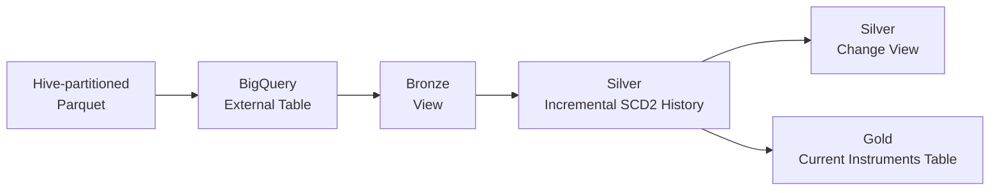

# Overview

DBT core introduction: key concepts and setup to get started.

- scripts         - contains helper script to generate data as a parquet files     
- dbt-workshop    - dbt starter project - example of layout, dedicated [Readme](dbt-workshop/README.md)         
- solutions       - (not the best) implementation of dbt-models for a workshop  



Below, you can find instructions how to create data and setup a GCP project for workshop.
If infra in place - go inside dbt-workshop and refer to its readme to get started using dbt for real!

## Generate source fixtures

Install the local generator dependencies, then create five dated change batches:

```bash
make install
make generate START_DATE=2026-08-13
```

The output layout is compatible with BigQuery Hive partitioning:

```text
data/instruments/
└── dt=YYYY-MM-DD/data.parquet
```

The Parquet payload uses BigQuery-compatible camelCase fields, but intentionally
stores identifiers and timestamps as strings. It includes unchanged records and
tracked-attribute changes. Defects are opt-in so the default fixture is a clean
happy path.

Inspect a local fixture with:

```bash
uv run python scripts/inspect_parquet.py \
  data/instruments/dt=2026-08-13/data.parquet
```

Upload the *contents* of the generated directory to the already-provisioned
bucket prefix:

```bash
gcloud storage cp --recursive \
  data/instruments \
  gs://YOUR_DATA_BUCKET/instruments
```

## Add defects by partition date

Pass one or more `--defect DATE:KIND` options to inject a deliberately bad row
into a chosen Hive partition. The date must be within the generated range.

| Kind | Result | Expected dbt outcome |
|---|---|---|
| `unsupported-code` | Validly typed row with unsupported currency and exchange codes | Bronze `accepted_values` tests fail. |
| `duplicate` | Duplicate `(instrument_id, effective_at)` row | Bronze uniqueness test fails. |
| `blank-required` | Blank instrument name | Bronze sends the row to its quarantine view. |

For example:

```bash
uv run python scripts/generate_events.py \
  --start-date 2026-08-13 \
  --days 5 \
  --defect 2026-08-15:blank-required \
  --defect 2026-08-16:duplicate

make generate START_DATE=2026-08-13 DAYS=5 \
  DEFECTS='2026-08-15:unsupported-code 2026-08-16:duplicate'
```

## Local checks

```bash
make format
make check
```

## Infra

1. Create a GCP Project
2. setup gcloud cli
3. enable corresponding services:
```bash
export PROJECT_ID="REPLACE_ME"
gcloud auth login
gcloud config set project "${PROJECT_ID}"
gcloud services enable bigquery.googleapis.com storage.googleapis.com
```
4. create a bucket:
```bash
export REGION="europe-west4"
export BUCKET="${PROJECT_ID}-bucket"
gcloud storage buckets create "gs://${BUCKET}" \
  --project="${PROJECT_ID}" \
  --location="${REGION}" \
  --uniform-bucket-level-access
```
5. copy there generated data:
```bash
gcloud storage cp --recursive \
  data/instruments/dt=2026-08-1* \
  "gs://${BUCKET}/instruments/"
```
6. Create a new google group at [https://groups.google.com](https://groups.google.com)
7. Assign permissions for participants:
```bash
WORKSHOP_GROUP="REPLACE_ME@googlegroups.com"
gcloud projects add-iam-policy-binding "${PROJECT_ID}" \
  --member="${WORKSHOP_GROUP}" \
  --role="roles/bigquery.user"

gcloud storage buckets add-iam-policy-binding "gs://${BUCKET}" \
  --member="${WORKSHOP_GROUP}" \
  --role="roles/storage.objectViewer"
```
