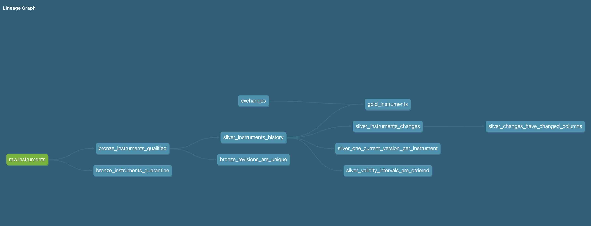

# Overview

We have a parquet files under some bucket at S3.
They content daily snapshots of attributes per instrument:   
```
- instrumentId
- instrumentName
- currencyCode
- exchangeCode
- effectiveAt
- sourceUpdatedAt
```
We have a csv file under `seeds` folder with exchange details [exchanges.csv](seeds/exchanges.csv)   

We want to create on top of them simple data-warehouse:
- bronze layer - where we just apply some simple sanitization to data
- silver layer - to have a history tracking as well view to show diff between revisions
- golden layer - latest revision per instrument from history, enriched with exchanges data

### Plan
- repo layout - macros/models/seeds/tests
- set up a connection dbt -> GCP Project at `profiles.yml`
- create an external table over parquet file at s3 - query layer on top of our `landing zone` - use a dbt macros
- load a csv into big query table via dbt seed
- source.yml - data assets that we use as input but have not too much control over
- schema.yml - definition of our models - names, schema and simple validations
- usage of `ref` vs `source`
- first model execution - lets create view in bronze layer! - `dbt run --select`
- data contract enforcement - names, types and more
- silver layer - incremental model - process only new entries, `unique_keys` that should not be null
- silver layer - tracking diff between revisions
- gold layer - final table with simple join
- tests and how to run them
- navigating DAG: `dbt ls`, tags, using `+` to select upstream or downstream, UI - `dbt docs generate && dbt docs serve`

**NOTE:** models are INTENTIONALLY left not implemented, but solutions are available in the root folder of project - [solutions](../solutions/).   
If you are in rush - copy files from `../solutions/models` into current `models` folder and run everything `dbt run`.    
Thats how resulting DAGs should look like:




## Set up

```bash
cd dbt-workshop
python -m venv VENV
source VENV/bin/activate
pip install -r requirements.txt
cp profiles.yml.example profiles.yml
```

Edit `profiles.yml`
```bash
project: __GCP_PROJECT_ID__
dataset: __BQ_DATASET__
location: __BQ_LOCATION__
```

In
`dbt_project.yml`, set `vars.raw_bucket` to the existing shared GCS bucket name,
without `gs://`.


```bash
dbt debug
dbt run-operation setup_sources
```

The macro creates `instruments_external` over:

```text
gs://<raw_bucket>/instruments/dt=YYYY-MM-DD/data.parquet
```

## Create a static table with csv content
```bash
dbt seed --select exchanges
```

## Create a couple of views on top of external table 
- run - create (or refresh) a model
- build - create (or refresh) a model and run a tests

```bash
dbt ls --select bronze_instruments_qualified
dbt build --select bronze_instruments_qualified
dbt ls --select bronze_instruments_quarantine
dbt build --select bronze_instruments_quarantine
```

## Build an incremental SCD2 history and diff between versions

```bash
dbt run --select silver_instruments_history
dbt build --select silver_instruments_history
dbt run --select silver_instruments_changes
dbt build --select silver_instruments_changes
```

## Finally create a gold table
```bash
dbt build --select gold_instruments
```

## Targeted builds and tags

After the first full build, use graph selection to rebuild a model with all of
its upstream dependencies:

```bash
dbt build --select +gold_instruments
```

The models are also tagged by layer (`bronze`, `silver`, and `gold`); the
history model additionally has the `scd2` tag. List a selection before running
it, then use the same selector for a focused build:

```bash
dbt ls --select tag:silver
dbt build --select tag:scd2
dbt build --select tag:gold
```

`+gold_instruments` means “the Gold model plus all its parents.” Use
`gold_instruments+` when you instead want its downstream dependants.

## Demonstrate safe schema changes on Silver

`silver_instruments_history` is incremental and uses
`on_schema_change: fail`. This makes an unreviewed change to the model's output
schema fail rather than silently altering the existing history table.

After building the model once, temporarily add a column to the `SELECT` in
`models/silver/silver_instruments_history.sql`, for example:

```sql
cast(null as string) as workshop_schema_change_demo
```

Then run:

```bash
dbt build --select silver_instruments_history
```

dbt should stop because the incremental target does not have the new column.
Remove the demonstration column to restore the original model. In a real
change, update the model contract deliberately and use a separately reviewed
migration or a full refresh, rather than weakening this protection.

## Explore the documentation site

Generate the dbt documentation artifacts after a build, then serve them
locally:

```bash
dbt docs generate
dbt docs serve
```

The site shows model and source descriptions, declared column contracts and
tests, and the lineage graph from the external source through Bronze, Silver,
and Gold. The test result status shown in the docs is from the most recent
`dbt build`.

## Task is to build full bronze/golden/layer views/table

The resulting lineage is:

```text
raw.instruments (external table)
  → bronze_instruments_qualified (view)
  → silver_instruments_history (incremental SCD2 table)
  → silver_instrument_changes (view)
  → gold_instruments (table)
```

`bronze_instruments_quarantine` contains rows that break data contracts.

## What to inspect

```sql
-- Type enforcement and column-name normalization
select * from bronze_instruments_qualified order by instrument_id, effective_at;

-- The quarantined malformed upstream rows
select * from bronze_instruments_quarantine;

-- SCD2 validity ranges and the current record
select * from silver_instruments_history order by instrument_id, valid_from;

-- Exactly which attributes changed between SCD2 versions
select * from silver_instruments_changes order by instrument_id, changed_at;

-- Current records enriched from the exchange seed
select * from instruments order by instrument_id;
```
## Check source freshness

The `raw.instruments` source measures freshness from its Hive `dt` partition,
which is the date the data arrived. It warns after two days and fails after
seven; this intentionally measures arrival freshness, not the business-effective
`effectiveAt` timestamp.

```bash
dbt source freshness --select source:raw.instruments
```

dbt writes the status to `target/sources.json`. Generate partitions that end near
the current date for a passing workshop demonstration. For a stale-data failure,
run the same command against an older latest partition.

## Manual SCD2 or dbt snapshot?

| Use the manual Silver model when… | Use a dbt snapshot when… |
|---|---|
| Business-effective history matters, including late-arriving corrections. | You need an audit trail of a mutable source table and only care when dbt observed each change. |
| You need explicit `scd_version`, validity ranges, a diff view, and custom incremental reprocessing. | The source has a reliable `updated_at` field or a small set of attributes to monitor with the built-in timestamp/check strategy. |
| You accept more SQL and tests in return for full control. | You want the simplest maintained history with dbt-managed validity columns. |

Snapshots do not automatically create a consumer-facing diff view, and their
validity timestamps reflect snapshot processing rather than an earlier
business-effective timestamp supplied in a late record. This workshop therefore
uses the manual SCD2 model.
